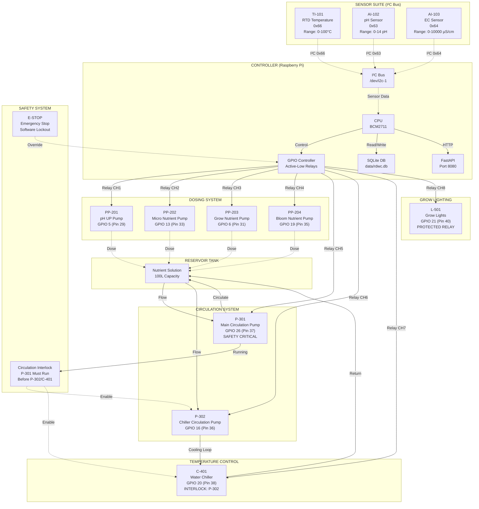

# RDWC System P&ID (Piping & Instrumentation Diagram)

**Document**: P&ID-001  
**System**: Recirculating Deep Water Culture (RDWC) v4  
**Date**: 2025-11-22  
**Revision**: As-Built v1.0  

---

## System Overview

This P&ID documents the complete RDWC system including sensors, actuators, plumbing, electrical connections, and control logic.



---

## Tag Nomenclature

Tags follow ISA-5.1 standard:

- **First Letter** (Measured Variable):
  - T = Temperature
  - A = Analysis (pH, EC)
  - P = Pump
  - L = Light
  - C = Cooling
  
- **Subsequent Letters** (Function):
  - I = Indicator
  - C = Controller
  - E = Element (sensor)
  
- **Loop Number**: XXX (e.g., 101, 201)

Examples:
- `TI-101`: Temperature Indicator #101 (RTD)
- `AI-102`: Analysis Indicator #102 (pH)
- `P-301`: Pump #301 (Main Circulation)

---

## Control Logic

### Circulation Safety Interlock
```
IF main_pump (P-301) == OFF:
    THEN chiller_pump (P-302) = FORCED OFF
    THEN water_chiller (C-401) = FORCED OFF
    
Reason: Prevents chiller operation without flow through main system
```

### Emergency Stop (E-STOP)
```
IF estop == ACTIVE:
    THEN ALL relays = FORCED OFF
    REQUIRE manual reset to resume
```

### pH Control Loop
```
IF mode == AUTO AND pH < target_low:
    DOSE ph_up (PP-201) per learned ml/pH ratio
    OBSERVE pH response
    UPDATE learner with actual delta
```

### EC Control Loop
```
IF mode == AUTO AND ec < target_low:
    DOSE nutrients (PP-202/203/204) per recipe
    RESPECT daily caps and press_cap
    LOG all doses to database
```

### Temperature Control
```
IF temp > target_high + hysteresis:
    START chiller_pump (P-302) [if main_pump running]
    START water_chiller (C-401) [if main_pump running]
    
IF temp < target_low:
    STOP water_chiller (C-401)
    STOP chiller_pump (P-302) after MIN_ON elapsed
```

### Lights Schedule
```
AT lights_on_time:
    SET grow_lights (L-501) = ON
    
AT lights_off_time:
    SET grow_lights (L-501) = OFF
    
Handles midnight crossover: ON 20:00, OFF 08:00 (next day)
```

---

## Process Flow Description

1. **Main Circulation**:
   - Main pump (P-301) continuously circulates nutrient solution
   - Flow rate: ~1000 L/hr (TBD based on actual pump)
   - Operating 24/7 unless E-STOP or maintenance mode

2. **Cooling Loop**:
   - Chiller pump (P-302) draws from main reservoir
   - Flows through water chiller (C-401) heat exchanger
   - Returns cooled solution to reservoir
   - Operates only when temperature exceeds setpoint + hysteresis
   - **INTERLOCK**: Requires main pump running

3. **Dosing System**:
   - Four peristaltic pumps for precise dosing
   - pH UP: Corrects low pH (target 5.5-6.3)
   - Micro/Grow/Bloom: NPK nutrients per grow stage
   - Safety caps: 120s/day per nutrient, 300s/day pH
   - Rates calibrated: ~X mL/s (see Maintenance Manual)

4. **Sensor Suite**:
   - RTD: Continuous temperature monitoring (10s poll)
   - pH: Continuous pH monitoring with temperature compensation
   - EC: Continuous EC monitoring with temperature compensation
   - I²C bus @ 100kHz, pullup resistors 4.7kΩ
   - Calibration: pH 3-point (4.0/7.0/10.0), EC 2-point (dry/1413µS)

5. **Grow Lights**:
   - Scheduled ON/OFF per grow stage (18/6 veg, 12/12 flower)
   - Protected relay: requires whitelisted reasons for manual override
   - Cooldown enforcement: MIN_OFF = 300s between cycles

---

## Alarm & Trip Conditions

| Condition | Alarm Level | Action |
|-----------|-------------|--------|
| pH < 5.0 or > 7.0 | HIGH | Alert, hold auto-dosing |
| EC < 500 or > 2500 µS/cm | HIGH | Alert, hold auto-dosing |
| Temp > 28°C | HIGH | Start chiller, alert if fails |
| Temp < 15°C | MEDIUM | Alert, chiller stuck on? |
| Sensor offline > 120s | HIGH | Alert, freeze automation |
| Main pump OFF unintentional | CRITICAL | E-STOP chiller system |
| Daily dose cap exceeded | MEDIUM | Alert, block further dosing |

---

## Material & Energy Balance

**Reservoir Volume**: 100L (configurable via `general.reservoir_liters`)

**Dosing Volumes** (typical per event):
- pH UP: 5-50 mL
- Micro: 10-120 mL
- Grow: 10-120 mL
- Bloom: 10-120 mL

**Electrical Power**:
- Raspberry Pi 4: 15W
- Main pump: ~50W (TBD)
- Chiller pump: ~30W (TBD)
- Water chiller: ~200W (TBD)
- Grow lights: ~600W (TBD)

---

## Fail-Safe States (Updated Mixed NC / NO Wiring)

Relays remain electrically active‑low at the GPIO signaling layer, but wiring now differentiates safety behavior:

| Device | Tag | GPIO | Relay Type | Fail (Power / Controller Loss) | Intended Fail Outcome |
|--------|-----|------|------------|--------------------------------|-----------------------|
| Main circulation pump | P-301 | 26 | NC | ON (continues running) | Maintain circulation & oxygenation |
| Chiller circulation pump | P-302 | 16 | NC | ON | Preserve chiller loop flow |
| Water chiller | C-401 | 20 | NC | ON | Avoid temperature spike |
| Grow lights | L-501 | 21 | NO | OFF | Prevent unintended light cycle extension |
| pH UP pump | PP-201 | 5 | NO | OFF | Prevent chemical overdosing |
| Micro nutrient pump | PP-202 | 13 | NO | OFF | Prevent nutrient overdosing |
| Grow nutrient pump | PP-203 | 6 | NO | OFF | Prevent nutrient overdosing |
| Bloom nutrient pump | PP-204 | 19 | NO | OFF | Prevent nutrient overdosing |

Behavior Summary:
1. Critical flow & cooling (P-301, P-302, C-401) fail ON using normally‑closed contacts.
2. Lights and all dosing pumps fail OFF using normally‑open contacts.
3. On boot the controller reconciles physical states; any divergence logged via relay guard anomalies endpoint.
4. E-STOP still forces all relays to commanded safe states irrespective of wiring type.

Recovery Notes:
- If outage spans a scheduled light transition, manually confirm lights state and upcoming edge.
- Review dose logs to ensure no partial dosing during outage window.
- Verify temperature within acceptable range; controller cooldown logic resumes automatically.

---

## Notes

1. All GPIO pins use BCM numbering (not physical pin numbers)
2. I²C sensors share common bus with unique addresses
3. Temperature compensation updates throttled: ΔT ≥ 0.2°C or ≥ 60s
4. Relay board active-low polarity confirmed via `RELAY_ACTIVE_LOW=1` env var
5. Database `data/rdwc.db` stores all readings, doses, and events
6. Sensor poller runs as separate systemd service (`rdwc-sensors`)
7. API service runs as systemd service (`rdwc.service`) on port 8080

---

**End of P&ID Document**
